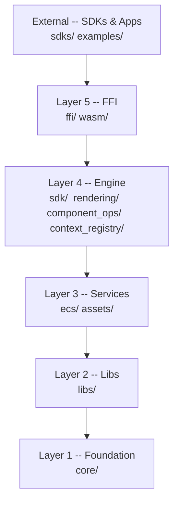

# GoudEngine Architecture

GoudEngine is a Rust-first game engine with wgpu as the default render backend and multi-language SDK support generated from a single schema. All game logic, physics, and rendering live in Rust; SDKs are thin wrappers over a C-ABI FFI boundary.

---

## Table of Contents

1. [Overview](#overview)
2. [Layer Hierarchy](#layer-hierarchy)
3. [Provider System](#provider-system)
4. [Graphics Subsystem](#graphics-subsystem)
5. [ECS Architecture](#ecs-architecture)
6. [Asset System](#asset-system)
7. [FFI Boundary](#ffi-boundary)
8. [SDK Bindings](#sdk-bindings)
9. [Codegen Pipeline](#codegen-pipeline)
10. [Configuration](#configuration)
11. [Data Flow: Game Loop](#data-flow-game-loop)
12. [Layer Dependency Rules](#layer-dependency-rules)

---

## Overview

GoudEngine targets desktop and web game development with a Rust core and multi-language bindings. The design priorities are:

- **Rust-first**: all game mechanics, physics, and rendering logic live in Rust. SDKs never duplicate this logic.
- **Thin FFI**: the C-ABI boundary is narrow and well-typed. Each SDK wraps it with idiomatic language conventions generated from a single schema.
- **Predictable architecture**: a strict 5-layer dependency hierarchy is enforced at build time by the `lint-layers` tool and checked in the pre-commit hook.
- **Provider abstraction**: engine subsystems (render, physics, audio, input, window, network, diagnostics) are accessed through swappable provider traits, enabling runtime backend selection and headless testing with null implementations.

---

## Layer Hierarchy

Dependencies flow **down only**. Upward imports are build-time violations enforced by `cargo run -p lint-layers`.



<!-- gen:layer-hierarchy -->
| Layer | Name | Directories | May Import From |
|-------|------|-------------|-----------------|
| 1 | Layer 1 (Foundation) | `core/` | (none) |
| 2 | Layer 2 (Libs) | `libs/` | Layer 1 (Foundation) |
| 3 | Layer 3 (Services) | `assets/`, `ecs/` | Layer 1 (Foundation), Layer 2 (Libs) |
| 4 | Layer 4 (Engine/SDK) | `component_ops/`, `context_registry/`, `rendering/`, `sdk/` | Layer 1 (Foundation), Layer 2 (Libs), Layer 3 (Services) |
| 5 | Layer 5 (FFI/WASM) | `ffi/`, `wasm/` | Layer 1 (Foundation), Layer 2 (Libs), Layer 3 (Services), Layer 4 (Engine/SDK) |
<!-- /gen:layer-hierarchy -->

SDKs (`sdks/`) and Apps (`examples/`) sit outside `goud_engine/src/` and connect via FFI only. They are not checked by `lint-layers` since they are separate projects.

Canonical source: `tools/lint_layers.rs`. Run `cargo run -p lint-layers` to validate.

---

## Provider System

Engine subsystems are abstracted behind provider traits defined in `goud_engine/src/core/providers/`. Each provider trait has one or more concrete implementations (e.g., `WgpuRenderProvider`, `Rapier2DPhysicsProvider`) selected at engine initialization time. Null/stub implementations exist for headless testing, so tests can run without a GPU context, audio device, or network socket.

The `Provider` supertrait requires `Send + Sync + 'static` for all providers except `WindowProvider`, which is `!Send + !Sync` because native windowing backends require main-thread access.

Providers are stored as trait objects (`Box<dyn XxxProvider>`) in a `ProviderRegistry`. Dynamic dispatch overhead is acceptable because provider calls are coarse-grained (per-frame or per-batch).

<!-- gen:providers -->
Provider traits: audio, diagnostics, input, network, physics, physics3d, render, window.
<!-- /gen:providers -->

See `goud_engine/src/core/providers/` for trait definitions and `docs/rfcs/RFC-0001-provider-trait-pattern.md` for the design rationale.

---

## Graphics Subsystem

Located in `libs/graphics/`.

### Render Backend

<!-- gen:default-backend -->
Default render backend: **Wgpu** (`RenderBackendKind::Wgpu`). Default window backend: **Winit** (`WindowBackendKind::Winit`).
<!-- /gen:default-backend -->

The `RenderBackend` trait abstracts the GPU backend. Both 2D (SpriteBatch) and 3D (Renderer3D) renderers are generic over this trait.

### Feature Flags

<!-- gen:feature-flags -->
| Feature | Dependencies |
|---------|-------------|
| `default` | `desktop-native` |
| `native` | `wgpu-backend`, `cc`, `bindgen`, `cbindgen`, `tiled`, `rayon`, `env_logger`, `toml`, `gltf`, `tobj`, `fbxcel`, `net-udp`, `net-tcp`, `net-ws`, `rapier2d`, `rapier3d` |
| `desktop-native` | `native`, `interprocess`, `notify`, `rodio` |
| `jni-bridge` | `jni` |
| `legacy-glfw-opengl` | `gl`, `glfw` |
| `lua` | `mlua` |
| `net-udp` | (empty) |
| `net-tcp` | (empty) |
| `net-webrtc` | (empty) |
| `net-ws` | `tungstenite`, `rustls` |
| `wgpu-backend` | `wgpu`, `winit`, `naga`, `pollster` |
| `web` | `wgpu-backend`, `wasm-bindgen`, `wasm-bindgen-futures`, `web-sys`, `js-sys` |
| `rapier2d` | `rapier2d` |
| `rapier3d` | `rapier3d` |
| `headless` | (empty) |
<!-- /gen:feature-flags -->

### SpriteBatch (2D)

Batches draw calls by texture and z-order to minimize GPU state changes. Uses orthographic projection and a `Camera2D` (position + zoom). Supports Tiled map rendering.

### Renderer3D

Renders 3D primitives with dynamic lighting. Uses perspective projection and a `Camera3D` (position, target, up vector).

### Camera Types

| Camera | Projection | Parameters |
|--------|-----------|------------|
| `Camera2D` | Orthographic | position, zoom |
| `Camera3D` | Perspective | position, target, up vector |

Cameras are separate from renderers. The renderer receives a camera reference each frame.

### GPU Backend Isolation

All raw GPU calls (`gl::` for OpenGL, `wgpu::` for wgpu) live in `libs/graphics/backend/`. No other module may use GPU-specific namespaces directly. This isolates backend-specific logic and allows backend selection at compile time via feature flags.

### Testing

Tests requiring a GPU context must use `test_helpers::init_test_context()`. Math-only tests (matrix calculations, projection math) do not need a GPU context.

---

## ECS Architecture

GoudEngine uses a Bevy-inspired Entity-Component-System architecture.

### Concepts

**World** -- owns all entities and components; the central ECS container.

**Entity** -- a generational ID (`index` + `generation` counter). Storing a raw `u32` is an anti-pattern; always use the entity type to detect stale references.

**Component** -- plain data struct. No methods with side effects. Derive `Debug` and `Clone`. Built-in components:

| Component | Purpose |
|-----------|---------|
| `Transform2D` | Local 2D spatial transform (position, rotation, scale) |
| `GlobalTransform2D` | World-space transform; computed by the propagation system |
| `Sprite` | Texture handle + color tint + flip flags |
| `RigidBody` | Physics body parameters |
| `Collider` | Collision shape definition |
| `AudioSource` | Audio clip handle + playback state |
| `Parent` / `Children` | Hierarchy relationships |

**System** -- a function that queries components from the World via type-safe generics. No raw index access.

**Query** -- typed access to components. Filter to the minimal set of components required. Never use `Any` or downcasting.

### Built-in Systems

| System | Timing |
|--------|--------|
| `propagate_transforms_2d` | After hierarchy mutations; updates `GlobalTransform2D` from `Transform2D` |
| Rendering system | End of frame; entities with `(GlobalTransform2D, Sprite)` to screen-space quads |

### ECS Data Flow

```
World
  |
  +-- Archetype storage (cache-friendly, grouped by component set)
  |     +-- Archetype { Transform2D, Sprite, GlobalTransform2D }
  |     +-- Archetype { Transform2D, RigidBody, Collider }
  |     +-- ...
  |
  +-- Query<(&Transform2D, &Sprite)>  -------- read-only iteration
  +-- Query<&mut Transform2D>          -------- mutation
  |
  +-- Systems (ordered via Schedule)
  |     1. User update callback
  |     2. propagate_transforms_2d
  |     3. Rendering system -> SpriteBatch
  |
  +-- Resources (singletons: InputManager, PhysicsWorld, AssetServer)
```

### Physics

Physics simulation uses the Provider trait pattern. `PhysicsProvider` wraps Rapier2D for 2D physics and `Physics3DProvider` wraps Rapier3D for 3D physics. Both are selected at initialization through the provider registry and can be swapped for null implementations in headless/test scenarios. Collision results are exposed via the FFI in the `collision` and `physics` modules.

---

## Asset System

Located in `goud_engine/src/assets/`.

### AssetServer

The central coordinator for all asset operations. Responsibilities:

- Loading assets from disk via registered `AssetLoader` implementations
- Storing loaded assets and returning `Handle<T>` references
- Watching the filesystem for changes and triggering hot-reload (development only)
- Managing audio playback via `audio_manager.rs`

### Handle<T>

Generational references to assets. Safe to store across frames. Using a stale handle after the asset is unloaded returns an error, not undefined behavior. Never pass raw asset pointers or file paths as references.

### Asset Loaders

<!-- gen:asset-loaders -->
Registered loaders (**12 total**): animation, audio, bitmap_font, config, font, material, mesh, script, shader, sprite_sheet, texture, tiled_map.
<!-- /gen:asset-loaders -->

See `goud_engine/src/assets/loaders/` for implementations.

### Error Handling

Loaders return `Result`. They never call `panic!()` or `unwrap()` on missing files. Missing assets produce a descriptive error message with the failing path.

### Hot-Reload

A filesystem watcher detects changes to asset files during development, reloads changed assets, and updates existing handles. Release builds may disable the watcher.

---

## FFI Boundary

Located in `goud_engine/src/ffi/`.

### Function Requirements

Every public FFI function must follow this pattern:

```rust
#[no_mangle]
pub extern "C" fn goud_entity_spawn(ctx_id: GoudContextId) -> GoudResult {
    // SAFETY: ctx_id is validated before dereferencing.
    let registry = get_context_registry().lock().unwrap();
    let ctx = registry.get(ctx_id)?;
    // ... operation
    0 // success
}
```

Rules:
- `#[no_mangle] pub extern "C"` on every public function
- Return errors as `i32`: 0 = success, negative = error code
- Null-check every pointer parameter before dereferencing
- Every `unsafe` block must have a `// SAFETY:` comment

### Type Requirements

- Structs shared across FFI must use `#[repr(C)]`
- Only C-compatible types in signatures: primitive integers, floats, `*const T`, `*mut T`, `bool`
- No `String`, `Vec`, `Option`, or other Rust-only types at the FFI boundary

### Error Propagation

FFI functions return `GoudResult` (an `i32`). Detailed error messages are stored in thread-local storage and retrieved via `goud_get_last_error_message()`. This avoids passing string pointers across the boundary for the common case.

### FFI Modules

<!-- gen:ffi-modules -->
FFI modules (**31 total**): animation, arena, audio, collision, component, component_sprite, component_sprite_animator, component_text, component_transform2d, context, debug, engine_config, entity, input, network, physics, plugin, pool, providers, renderer, renderer3d, scene, scene_loading, scene_loading_tests, scene_tests, scene_transition, scene_transition_tests, spatial_grid, types, ui, window.
<!-- /gen:ffi-modules -->

See `goud_engine/src/ffi/mod.rs` for the current module tree.

### FFI Call Flow

```
C# / Python / TypeScript / Go / Swift / ...
        |
        |  goud_*(ctx_id, ...)
        v
  FFI function (goud_engine/src/ffi/)
        |
        |  get_context_registry().lock() -> GoudContextHandle
        v
  context_registry resolves GoudContextId -> GoudContext
        |
        |  context.world.{spawn, set_component, query, ...}
        v
  ECS World operation
        |
        v
  Graphics / Physics / Audio backend (via providers)
```

### Memory Ownership

The default convention is: caller allocates, caller frees. Any deviation must be documented on the function. Box-allocated values returned to callers require a corresponding `_free` function.

---

## SDK Bindings

### Thin Wrapper Rule

SDKs call FFI functions. They never implement game logic, math, physics, or rendering. If logic appears in an SDK, it must be moved to Rust and exposed via FFI.

**Math-in-SDK exception**: Simple value-type operations (`Vec2.add`, `Color.fromHex`) are computed locally in the TypeScript SDK to avoid FFI round-trips. These are generated by codegen, not hand-written.

### All SDKs

<!-- gen:sdk-table -->
| SDK | Path |
|-----|------|
| C | `sdks/c/` |
| C++ | `sdks/cpp/` |
| C# | `sdks/csharp/` |
| Go | `sdks/go/` |
| Kotlin | `sdks/kotlin/` |
| Lua | `sdks/lua/` |
| Python | `sdks/python/` |
| Rust | `sdks/rust/` |
| Swift | `sdks/swift/` |
| TypeScript | `sdks/typescript/` |

Total: 10 SDK languages.
<!-- /gen:sdk-table -->

### Rust SDK

`sdks/rust/` is a convenience re-export crate. `goud_engine/src/sdk/` contains the actual implementation (`GoudGame`, `EntityBuilder`, `GameConfig`). No FFI indirection -- direct access to internal types.

### C# SDK

Targets .NET 8.0. `NativeMethods.g.cs` is auto-generated by `csbindgen` on every `cargo build`. The same build also refreshes `codegen/generated/goud_engine.h` for native header consumers. The wrapper classes in `sdks/csharp/generated/` are produced by `gen_csharp.py`. csbindgen handles raw `[DllImport]` declarations, and the generator produces the public API.

### Python SDK

Uses `ctypes`. `sdks/python/goud_engine/generated/_ffi.py` declares all `argtypes` and `restype` annotations. Loads `.so` on Linux and `.dylib` on macOS.

### TypeScript SDK

Two build targets under a single directory (`sdks/typescript/`):
- **Node.js** (`src/generated/node/`): N-API via `napi-rs`. The JS boundary accepts `f64` (JavaScript's native number type) and casts to `f32` internally where the Rust engine expects it.
- **Web** (`src/generated/web/`): WASM via `wasm-bindgen`.

---

## Codegen Pipeline

Codegen produces all files under `sdks/*/generated/`. Do not edit them by hand.

### Inputs

| File | Role |
|------|------|
| `codegen/goud_sdk.schema.json` | Source of truth: types, enums, tools (classes), methods, factory methods |
| `codegen/ffi_mapping.json` | Maps schema methods to `extern "C"` function names, parameter types, struct layouts |
| `codegen/ffi_manifest.json` | Auto-generated by `cargo build`; lists every `#[no_mangle]` function with its actual signature |
| `codegen/generated/goud_engine.h` | Auto-generated by `cargo build`; the canonical C header packaged with native artifacts |

### Generators

<!-- gen:codegen-generators -->
| Generator | Output |
|-----------|--------|
| `gen_cpp.py` | C++ SDK bindings |
| `gen_csharp.py` | C# SDK bindings |
| `gen_go.py` | Go cgo bindings |
| `gen_go_sdk.py` | Go SDK wrapper |
| `gen_jni.py` | JNI bindings |
| `gen_kotlin.py` | Kotlin SDK bindings |
| `gen_lua.py` | Lua SDK bindings |
| `gen_python.py` | Python SDK bindings |
| `gen_sdk_scaffolding.py` | SDK package scaffolding |
| `gen_swift.py` | Swift SDK bindings |
| `gen_ts_node.py` | TypeScript Node.js bindings |
| `gen_ts_web.py` | TypeScript Web/WASM bindings |

Total: 12 generators.
<!-- /gen:codegen-generators -->

### Pipeline

<!-- gen:codegen-steps -->
The full pipeline runs **19 steps** (see `codegen.sh` for details).
<!-- /gen:codegen-steps -->

Run the full pipeline: `./codegen.sh`

### Naming Conventions

| Language | Methods | Types | Files |
|----------|---------|-------|-------|
| C# | PascalCase | PascalCase | `PascalCase.cs` |
| Python | snake_case | snake_case | `snake_case.py` |
| TypeScript | camelCase | PascalCase | `camelCase.ts` |

### Adding a New SDK Language

1. Add type mappings to `codegen/sdk_common.py`
2. Create `codegen/gen_<lang>.py` using an existing generator as a template
3. Output generated files to `sdks/<lang>/generated/`
4. Add validation coverage in CI

See `docs/src/architecture/adding-a-language.md` for the full walkthrough.

---

## Configuration

<!-- gen:gameconfig-fields -->
| Field | Type | Description |
|-------|------|-------------|
| `title` | `String` | Window title displayed in the title bar. |
| `width` | `u32` | Window width in pixels. |
| `height` | `u32` | Window height in pixels. |
| `vsync` | `bool` | Enable vertical sync to prevent screen tearing. |
| `fullscreen_mode` | `FullscreenMode` | Fullscreen mode for the window. |
| `resizable` | `bool` | Enable window resizing. |
| `anti_aliasing_mode` | `AntiAliasingMode` | Runtime anti-aliasing mode for 3D rendering. |
| `msaa_samples` | `u32` | Requested MSAA sample count (1, 2, 4, or 8). |
| `render_backend` | `RenderBackendKind` | Native render backend selection. |
| `window_backend` | `WindowBackendKind` | Native window backend selection. |
| `target_fps` | `u32` | Target frames per second (0 = unlimited). |
| `debug_rendering` | `bool` | Enable debug rendering (collision boxes, etc.). |
| `show_fps_overlay` | `bool` | Show the FPS stats overlay. |
| `physics_debug` | `PhysicsDebugConfig` | Physics debug visualization settings. |
| `fps_update_interval` | `f32` | How often (in seconds) the FPS overlay recomputes statistics. |
| `diagnostic_mode` | `bool` | Enable diagnostic mode for detailed engine telemetry and error reporting. |
| `debugger` | `DebuggerConfig` | Debugger runtime configuration. |
| `lua_hot_reload` | `bool` | Whether Lua script hot-reload is enabled. Defaults to `true` in debug builds and `false` in release builds. |
| `aspect_ratio_lock` | `AspectRatioLock` | Viewport aspect ratio lock. |
| `fixed_timestep` | `f32` | Fixed timestep size in seconds (0.0 = disabled). |
| `max_fixed_steps_per_frame` | `u32` | Maximum fixed steps per frame to prevent spiral of death. |
<!-- /gen:gameconfig-fields -->

See `goud_engine/src/sdk/game_config.rs` for the full definition.

---

## Data Flow: Game Loop

Each frame executes the following sequence:

1. **Event poll** -- platform backend calls `poll_events()`, which feeds keyboard, mouse, and gamepad state into `InputManager`.
2. **User update** -- the game's update callback runs. It queries the ECS world, mutates components, spawns/despawns entities, and reads input from `InputManager`.
3. **Transform propagation** -- `propagate_transforms_2d` system traverses the `Parent`/`Children` hierarchy and writes computed world-space transforms into `GlobalTransform2D`.
4. **Rendering** -- the rendering system queries entities with `(GlobalTransform2D, Sprite)`, converts them to screen-space quads, and submits them to `SpriteBatch`.
5. **SpriteBatch flush** -- sprites are grouped by texture and sorted by z-order, then submitted as batched draw calls to the render backend.
6. **Buffer swap** -- `swap_buffers()` presents the completed frame. Loop returns to step 1.

```
poll_events()
    |
    v
InputManager (keyboard, mouse, gamepad state)
    |
    v
User update callback
  +-- query(World) -> read component data
  +-- mutate components (Transform2D, etc.)
  +-- spawn / despawn entities
    |
    v
propagate_transforms_2d
  +-- Transform2D + hierarchy -> GlobalTransform2D
    |
    v
Rendering system
  +-- (GlobalTransform2D, Sprite) -> screen-space quads
    |
    v
SpriteBatch::flush()
  +-- group by texture, sort by z -> GPU draw calls
    |
    v
swap_buffers() -> frame presented
```

---

## Layer Dependency Rules

These rules are enforced by `cargo run -p lint-layers` and in the pre-commit hook.

### Allowed Imports

The layer table in [Layer Hierarchy](#layer-hierarchy) defines what each layer may import. The canonical definition is in `tools/lint_layers.rs`.

### Explicit Prohibitions

- **Foundation** (`core/`) must not import from any other engine layer -- only external crates.
- **Libs** (`libs/`) must not import from Services, Engine, or FFI layers -- this is an upward import violation.
- **Services** (`ecs/`, `assets/`) must not import from Engine or FFI layers.
- **Engine** (`sdk/`, `rendering/`, `component_ops/`, `context_registry/`) must not import from FFI. The FFI layer may import from Engine, but not the reverse.
- **SDKs** must not call Rust internal APIs directly -- only FFI (`goud_*` functions).

### Validation

```bash
# Run layer validation manually
cargo run -p lint-layers

# Full codegen pipeline (includes lint-layers as step 5)
./codegen.sh

# Generate module dependency graph
./graph.sh  # outputs module_graph.png and module_graph.pdf
```

A `use crate::ffi::` statement inside `libs/` or a `use crate::sdk::` inside `core/` are examples of hierarchy violations that `lint-layers` will catch.
