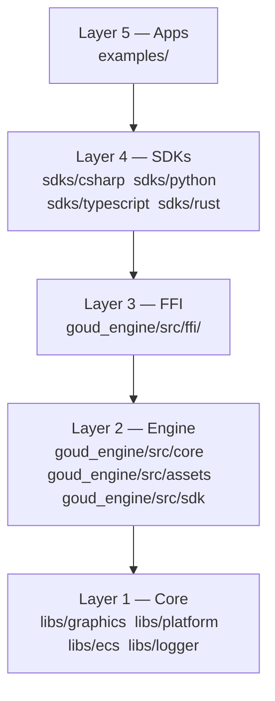
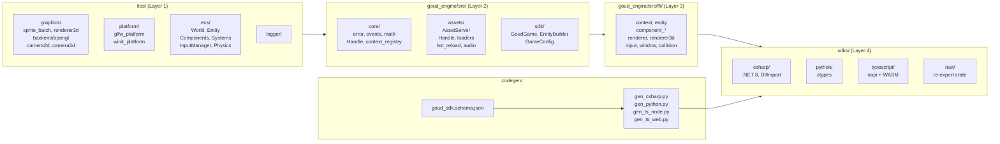
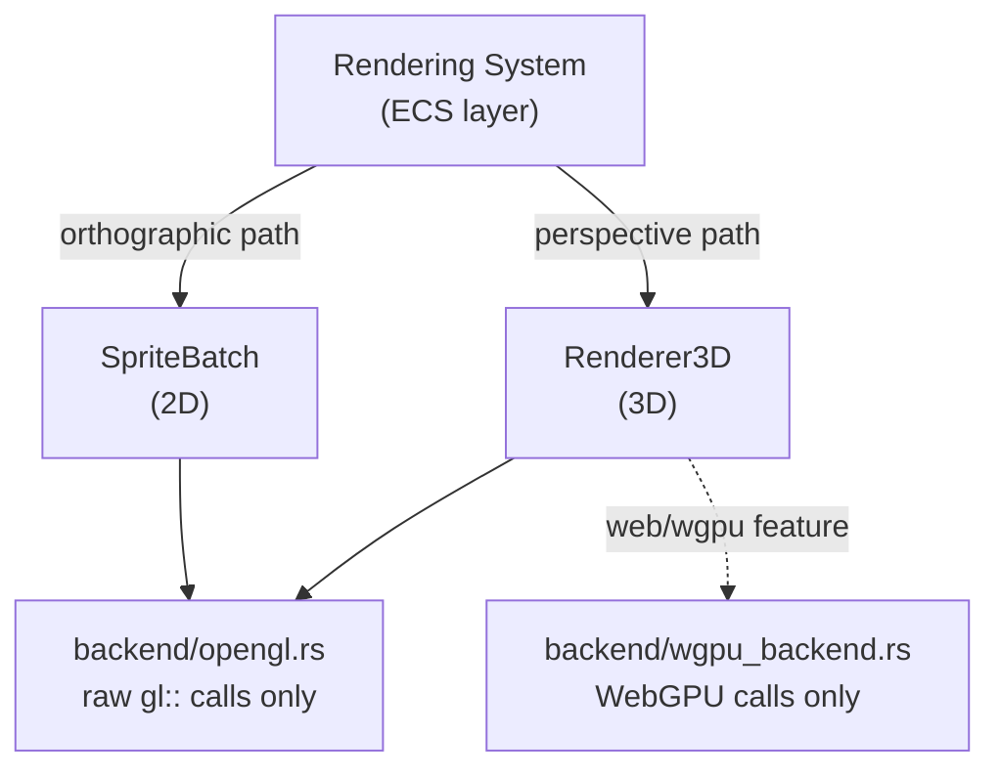

# GoudEngine Architecture

GoudEngine is a Rust game engine with multi-language SDK support. All game logic lives in Rust. SDKs are thin wrappers that marshal data and call FFI functions — they do not implement logic. Four SDK targets are supported: C# (.NET), Python, TypeScript (Node.js and browser/WASM), and Rust (zero overhead, no FFI).

---

## Table of Contents

1. [Overview](#overview)
2. [Layer Hierarchy](#layer-hierarchy)
3. [Module Map](#module-map)
4. [Core Modules](#core-modules)
5. [ECS Architecture](#ecs-architecture)
6. [Asset System](#asset-system)
7. [Graphics Subsystem](#graphics-subsystem)
8. [FFI Boundary](#ffi-boundary)
9. [SDK Bindings](#sdk-bindings)
10. [Codegen Pipeline](#codegen-pipeline)
11. [Data Flow: Game Loop](#data-flow-game-loop)
12. [Renderer Selection](#renderer-selection)
13. [Layer Dependency Rules](#layer-dependency-rules)

---

## Overview

GoudEngine targets desktop game development with a Rust core and multi-language bindings. The design priorities are:

- **Rust-first**: all game mechanics, physics, and rendering logic live in Rust. SDKs never duplicate this logic.
- **Thin FFI**: the C-ABI boundary is narrow and well-typed. Each SDK wraps it with idiomatic language conventions generated from a single schema.
- **Predictable architecture**: a strict 5-layer dependency hierarchy is enforced at build time by the `lint-layers` tool and checked in the pre-commit hook.

The primary SDK target is C# (used by the bundled game examples). Python and TypeScript targets exist for parity testing and alternative workflows.

---

## Layer Hierarchy

Dependencies flow **down only**. A layer may import from layers below it. Upward imports are a build-time violation.



| Layer | Path | Responsibility |
|-------|------|----------------|
| 1 — Core | `libs/` | Graphics backend, platform windowing, ECS, logging |
| 2 — Engine | `goud_engine/src/` | Asset system, native Rust SDK, context registry |
| 3 — FFI | `goud_engine/src/ffi/` | C-ABI exports consumed by external SDKs |
| 4 — SDKs | `sdks/` | Language-specific wrappers over FFI |
| 5 — Apps | `examples/` | Example games using SDK APIs |

---

## Module Map



---

## Core Modules

### `goud_engine/src/core/`

| File | Responsibility |
|------|----------------|
| `error.rs` | `GoudError`, `GoudErrorCode`, `GoudResult` using `thiserror` |
| `event.rs`, `events.rs` | Typed event system; no string-based dispatch |
| `handle.rs` | Generational `Handle<T>`: index + generation counter prevents use-after-free |
| `math.rs` | `Vec2`, `Vec3`, `Vec4`, `Color`, `Rect`, `Mat3x3` wrapping `glam`; `#[repr(C)]` for FFI |
| `context_registry/` | Thread-safe registry: `GoudContextId` (u64) maps to isolated `GoudContext` instances |

The context registry is the backbone of the FFI boundary. Every FFI function takes a `GoudContextId` as its first parameter. The registry resolves that ID to an engine instance under a mutex. Using a stale ID after context destruction returns an error rather than accessing freed memory.

### `libs/`

| Module | Responsibility |
|--------|----------------|
| `libs/graphics/` | 2D sprite batching, 3D renderer, OpenGL backend, camera types |
| `libs/platform/` | `PlatformBackend` trait, GLFW backend, winit backend |
| `libs/ecs/` | World, Entity, Component, System, Query, InputManager, PhysicsWorld |
| `libs/logger/` | Logging infrastructure |

### `goud_engine/src/assets/`

Asset loading, storage, and hot-reload. See [Asset System](#asset-system).

### `goud_engine/src/sdk/`

Native Rust API. Zero FFI overhead. Provides `GoudGame`, `EntityBuilder`, and `GameConfig`. See [SDK Bindings](#sdk-bindings).

---

## ECS Architecture

GoudEngine uses a Bevy-inspired Entity-Component-System architecture.

### Concepts

**World** — owns all entities and components; the central ECS container.

**Entity** — a generational ID (`index` + `generation` counter). Storing a raw `u32` is an anti-pattern; always use the entity type to detect stale references.

**Component** — plain data struct. No methods with side effects. Derive `Debug` and `Clone`. Built-in components:

| Component | Purpose |
|-----------|---------|
| `Transform2D` | Local 2D spatial transform (position, rotation, scale) |
| `GlobalTransform2D` | World-space transform; computed by the propagation system |
| `Sprite` | Texture handle + color tint + flip flags |
| `RigidBody` | Physics body parameters |
| `Collider` | Collision shape definition |
| `AudioSource` | Audio clip handle + playback state |
| `Parent` / `Children` | Hierarchy relationships |

**System** — a function that queries components from the World via type-safe generics. No raw index access.

**Query** — typed access to components. Filter to the minimal set of components required. Never use `Any` or downcasting.

### Built-in Systems

| System | Timing |
|--------|--------|
| `propagate_transforms_2d` | After hierarchy mutations; updates `GlobalTransform2D` from `Transform2D` |
| Rendering system | End of frame; entities with `(GlobalTransform2D, Sprite)` → screen-space quads |

### ECS Data Flow

```
World
  │
  ├── Archetype storage (cache-friendly, grouped by component set)
  │     ├── Archetype { Transform2D, Sprite, GlobalTransform2D }
  │     ├── Archetype { Transform2D, RigidBody, Collider }
  │     └── ...
  │
  ├── Query<(&Transform2D, &Sprite)>  ──────── read-only iteration
  ├── Query<&mut Transform2D>          ──────── mutation
  │
  ├── Systems (ordered via Schedule)
  │     1. User update callback
  │     2. propagate_transforms_2d
  │     3. Rendering system → SpriteBatch
  │
  └── Resources (singletons: InputManager, PhysicsWorld, AssetServer)
```

### Physics

`PhysicsWorld` with `BroadPhase` collision detection. Collision results are exposed via the FFI in `collision.rs`.

---

## Asset System

Located in `goud_engine/src/assets/`.

### AssetServer

The central coordinator for all asset operations. Responsibilities:

- Loading assets from disk via registered `AssetLoader` implementations
- Storing loaded assets and returning `Handle<T>` references
- Watching the filesystem for changes and triggering hot-reload (development only)
- Managing audio playback via `audio_manager.rs`

### Handle<T>

Generational references to assets. Safe to store across frames. Using a stale handle after the asset is unloaded returns an error, not undefined behavior. Never pass raw asset pointers or file paths as references.

### Asset Loaders

| Loader | Formats | Crate |
|--------|---------|-------|
| Texture | PNG, JPG | `image` |
| Shader | GLSL (vertex + fragment) | custom |
| Audio | WAV, OGG | `rodio` |

### Error Handling

Loaders return `Result`. They never call `panic!()` or `unwrap()` on missing files. Missing assets produce a descriptive error message with the failing path.

### Hot-Reload

A filesystem watcher detects changes to asset files during development, reloads changed assets, and updates existing handles. Release builds may disable the watcher.

---

## Graphics Subsystem

Located in `libs/graphics/`.

### Renderer Trait

`Renderer` is the abstract interface for all rendering backends. Selecting a concrete renderer happens at `GoudGame` initialization. Both 2D and 3D renderers implement this trait.

### SpriteBatch (2D)

Batches draw calls by texture and z-order to minimize GPU state changes. Uses orthographic projection and a `Camera2D` (position + zoom). Supports Tiled map rendering.

### Renderer3D

Renders 3D primitives with dynamic lighting. Uses perspective projection and a `Camera3D` (position, target, up vector).

### OpenGL Isolation

All raw `gl::` calls live in `libs/graphics/backend/opengl.rs`. No other module may use the `gl::` namespace. This isolates backend-specific logic and enables a future backend swap (Vulkan, Metal, wgpu) without touching higher layers.

The `backend/` module also contains a `wgpu_backend.rs` for WebGPU rendering (browser/cross-platform).



### Camera Types

| Camera | Projection | Parameters |
|--------|-----------|------------|
| `Camera2D` | Orthographic | position, zoom |
| `Camera3D` | Perspective | position, target, up vector |

Cameras are separate from renderers. The renderer receives a camera reference each frame.

### Testing

Tests requiring a GL context must use `test_helpers::init_test_context()`. Math-only tests (matrix calculations, projection math) do not need a GL context.

---

## FFI Boundary

Located in `goud_engine/src/ffi/`.

### Function Requirements

Every public FFI function must follow this pattern:

```rust
#[no_mangle]
pub extern "C" fn goud_entity_spawn(ctx_id: GoudContextId) -> GoudResult {
    // SAFETY: ctx_id is validated before dereferencing.
    let registry = get_context_registry().lock().unwrap();
    let ctx = registry.get(ctx_id)?;
    // ... operation
    0 // success
}
```

Rules:
- `#[no_mangle] pub extern "C"` on every public function
- Return errors as `i32`: 0 = success, negative = error code
- Null-check every pointer parameter before dereferencing
- Every `unsafe` block must have a `// SAFETY:` comment

### Type Requirements

- Structs shared across FFI must use `#[repr(C)]`
- Only C-compatible types in signatures: primitive integers, floats, `*const T`, `*mut T`, `bool`
- No `String`, `Vec`, `Option`, or other Rust-only types at the FFI boundary

### Error Propagation

FFI functions return `GoudResult` (an `i32`). Detailed error messages are stored in thread-local storage and retrieved via `goud_get_last_error_message()`. This avoids passing string pointers across the boundary for the common case.

### FFI File Organization

| File | Domain |
|------|--------|
| `context.rs` | Engine context create/destroy |
| `entity.rs` | Entity spawn/despawn |
| `component.rs` | Generic component add/remove/query |
| `component_transform2d.rs` | Transform2D operations |
| `component_sprite.rs` | Sprite operations |
| `renderer.rs` | 2D rendering |
| `renderer3d.rs` | 3D rendering |
| `input.rs` | Input state queries |
| `window.rs` | Window management, frame lifecycle |
| `collision.rs` | Collision detection results |
| `types.rs` | `#[repr(C)]` type definitions shared across the boundary |

### FFI Call Flow

```
C# / Python / TypeScript
        │
        │  goud_*(ctx_id, ...)
        ▼
  FFI function (goud_engine/src/ffi/)
        │
        │  get_context_registry().lock() → GoudContextHandle
        ▼
  context_registry resolves GoudContextId → GoudContext
        │
        │  context.world.{spawn, set_component, query, ...}
        ▼
  ECS World operation
        │
        ▼
  Graphics / Physics backend
```

### Memory Ownership

The default convention is: caller allocates, caller frees. Any deviation must be documented on the function. Box-allocated values returned to callers require a corresponding `_free` function.

---

## SDK Bindings

### All SDKs at a Glance

| SDK | Path | Mechanism | Packaging | Overhead |
|-----|------|-----------|-----------|---------|
| Rust | `sdks/rust/` | Re-export crate wrapping internal API | crates.io | Zero (no FFI) |
| C# | `sdks/csharp/` | `DllImport` declarations + wrapper classes | NuGet | Minimal (P/Invoke) |
| Python | `sdks/python/` | `ctypes` declarations in `generated/_ffi.py` | PyPI | Low (ctypes) |
| TypeScript | `sdks/typescript/` | N-API (Node.js) + wasm-bindgen (browser) | npm | N-API minimal; WASM moderate |

### Rust SDK

`sdks/rust/` is a convenience re-export crate. `goud_engine/src/sdk/` contains the actual implementation (`GoudGame`, `EntityBuilder`, `GameConfig`). No FFI indirection — direct access to internal types.

### C# SDK

Targets .NET 8.0. `NativeMethods.g.cs` is auto-generated by `csbindgen` on every `cargo build`. The wrapper classes in `sdks/csharp/generated/` are produced by `gen_csharp.py`. Both files work together: csbindgen handles raw `[DllImport]` declarations; the Python generator produces the public API.

### Python SDK

Uses `ctypes`. `sdks/python/goud_engine/generated/_ffi.py` declares all `argtypes` and `restype` annotations. Loads `.so` on Linux and `.dylib` on macOS.

### TypeScript SDK

Two build targets:
- **Node.js** (`sdks/typescript-node/`): N-API via `napi-rs`. The JS boundary accepts `f64` (JavaScript's native number type) and casts to `f32` internally where the Rust engine expects it.
- **Web** (`sdks/typescript-web/`): WASM via `wasm-bindgen`.

**Math-in-SDK exception**: Simple value-type operations (`Vec2.add`, `Color.fromHex`) are computed locally in the TypeScript SDK to avoid FFI round-trips. These are generated by codegen, not hand-written.

### Thin Wrapper Rule

SDKs call FFI functions. They never implement game logic, math, physics, or rendering. If logic appears in an SDK, it must be moved to Rust and exposed via FFI.

---

## Codegen Pipeline

Codegen produces all files under `sdks/*/generated/`. Do not edit them by hand.

### Inputs

| File | Role |
|------|------|
| `codegen/goud_sdk.schema.json` | Source of truth: types, enums, tools (classes), methods, factory methods |
| `codegen/ffi_mapping.json` | Maps schema methods to `extern "C"` function names, parameter types, struct layouts |
| `codegen/ffi_manifest.json` | Auto-generated by `cargo build`; lists every `#[no_mangle]` function with its actual signature |

### Pipeline

```
goud_sdk.schema.json
ffi_mapping.json          ──► gen_csharp.py   ──► sdks/csharp/generated/
ffi_manifest.json         ──► gen_python.py   ──► sdks/python/goud_engine/generated/
                          ──► gen_ts_node.py  ──► sdks/typescript-node/generated/
                          ──► gen_ts_web.py   ──► sdks/typescript-web/generated/

cargo build               ──► csbindgen       ──► sdks/csharp/NativeMethods.g.cs

validate_coverage.py checks: every function in ffi_manifest.json has a ffi_mapping.json entry
validate.py checks:          every schema method has a ffi_mapping.json entry (and vice versa)
```

Run the full pipeline:

```bash
./codegen.sh
```

The script executes 8 ordered steps: build, lint-layers, validate_coverage, gen_csharp, gen_python, gen_ts_node, gen_ts_web, validate. Steps 3 and 8 are validation gates that abort the pipeline on failure.

### Naming Conventions Applied by Generators

| Language | Methods | Types | Files |
|----------|---------|-------|-------|
| C# | PascalCase | PascalCase | `PascalCase.cs` |
| Python | snake_case | snake_case | `snake_case.py` |
| TypeScript | camelCase | PascalCase | `camelCase.ts` |

### Adding a New SDK Language

1. Add type mappings to `codegen/sdk_common.py`
2. Create `codegen/gen_<lang>.py` using an existing generator as a template
3. Output generated files to `sdks/<lang>/generated/`
4. Add validation coverage in CI

See `docs/architecture/adding-a-new-language.md` for the full walkthrough.

---

## Data Flow: Game Loop

Each frame executes the following sequence:

1. **Event poll** — platform backend calls `poll_events()`, which feeds keyboard, mouse, and gamepad state into `InputManager`.
2. **User update** — the game's update callback runs. It queries the ECS world, mutates components, spawns/despawns entities, and reads input from `InputManager`.
3. **Transform propagation** — `propagate_transforms_2d` system traverses the `Parent`/`Children` hierarchy and writes computed world-space transforms into `GlobalTransform2D`.
4. **Rendering** — the rendering system queries entities with `(GlobalTransform2D, Sprite)`, converts them to screen-space quads, and submits them to `SpriteBatch`.
5. **SpriteBatch flush** — sprites are grouped by texture and sorted by z-order, then submitted as batched draw calls to the OpenGL backend.
6. **Buffer swap** — `swap_buffers()` presents the completed frame. Loop returns to step 1.

```
poll_events()
    │
    ▼
InputManager (keyboard, mouse, gamepad state)
    │
    ▼
User update callback
  ├── query(World) → read component data
  ├── mutate components (Transform2D, etc.)
  └── spawn / despawn entities
    │
    ▼
propagate_transforms_2d
  └── Transform2D + hierarchy → GlobalTransform2D
    │
    ▼
Rendering system
  └── (GlobalTransform2D, Sprite) → screen-space quads
    │
    ▼
SpriteBatch::flush()
  └── group by texture, sort by z → OpenGL draw calls
    │
    ▼
swap_buffers() → frame presented
```

---

## Renderer Selection

The renderer is selected once at `GoudGame` initialization. It cannot be changed at runtime.

```rust
// Rust SDK
GoudGame::new(GameConfig {
    width: 800,
    height: 600,
    title: "My Game".into(),
    renderer: RendererType::Renderer2D,
})
```

```csharp
// C# SDK
new GoudGame(800, 600, "My Game", RendererType.Renderer2D)
```

### What Each Renderer Provides

| Feature | Renderer2D | Renderer3D |
|---------|-----------|------------|
| Sprite rendering | Yes | No |
| Tiled map support | Yes | No |
| Camera type | Camera2D (orthographic) | Camera3D (perspective) |
| 3D primitives | No | Yes |
| Dynamic lighting | No | Yes |
| Use case | 2D games, UI | 3D scenes |

---

## Layer Dependency Rules

These rules are enforced at build time by the `lint-layers` binary (`tools/lint-layers/`) and in the pre-commit hook.

### Allowed Imports

| Layer | May import from |
|-------|----------------|
| Layer 1 — Core (`libs/`) | External crates only. No imports from `goud_engine/`, `ffi/`, `sdk/`, or `sdks/` |
| Layer 2 — Engine (`goud_engine/src/core`, `assets`, `sdk`) | Layer 1 (`libs/`) and peer modules in Layer 2. NEVER from `ffi/` or `sdks/` |
| Layer 3 — FFI (`goud_engine/src/ffi/`) | Layers 1 and 2. NEVER from `sdks/` |
| Layer 4 — SDKs (`sdks/`) | Layer 3 FFI via the C ABI. No direct Rust imports from the engine |
| Layer 5 — Apps (`examples/`) | Layer 4 SDK API only |

### Explicit Prohibitions

- `libs/` cannot import from `goud_engine/` — this is an upward import.
- `goud_engine/src/ffi/` cannot import from `goud_engine/src/sdk/` — FFI is below sdk in the dependency graph. The `sdk/` module may import from `ffi/`-adjacent modules but not the reverse.
- SDKs must not call Rust internal APIs directly — only FFI (`goud_*` functions).
- `goud_engine/src/sdk/` must not import from `goud_engine/src/ffi/`.

### Validation

```bash
# Run layer validation manually
cargo run -p lint-layers

# Full codegen pipeline (includes lint-layers as step 2)
./codegen.sh

# Generate module dependency graph
./graph.sh  # outputs module_graph.png and module_graph.pdf
```

A `use goud_engine::` statement inside `libs/` or a `use crate::ffi::` inside `libs/graphics/` are examples of hierarchy violations that `lint-layers` will catch.
