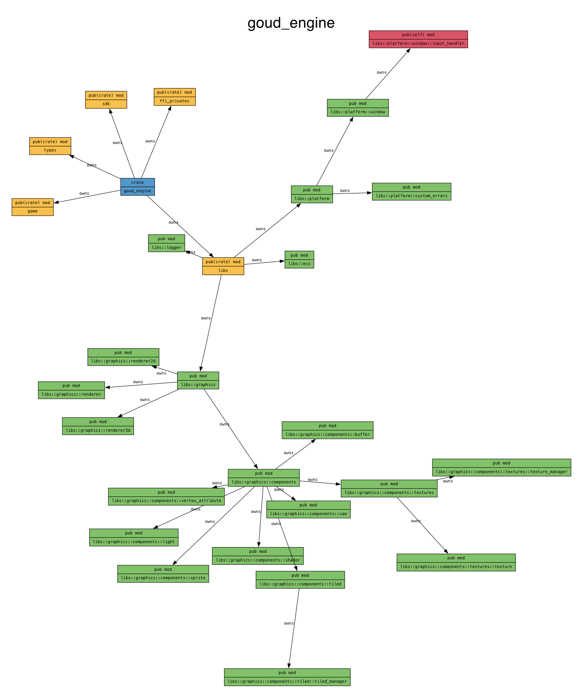

# GoudEngine

GoudEngine is a game engine written in Rust, designed to be used with C# applications. It provides a set of tools and libraries for creating 2D and 3D games.

## Features

- Flexible renderer selection (2D or 3D)
- 2D rendering with sprite management
- 3D rendering with primitive support (cubes, spheres, planes, cylinders)
- 3D Dynamic lighting system with multiple light types (point, directional, spot)
- Input handling
- Window management
- Graphics rendering with OpenGL
- Integration with C# using csbindgen

## Architecture

Below is the module dependency graph of GoudEngine, showing the relationship between different components:



You can regenerate this module dependency graph by running:

```sh
./graph.sh
```

This will create both PNG and PDF versions of the module graph using `cargo modules` and GraphViz tools.

## Development

### Quick Start
For rapid development and testing, use the `dev.sh` script:

```sh
# Run a specific game example
./dev.sh --game flappy_goud  # 2D game example
./dev.sh --game 3d_cube      # 3D game example
./dev.sh --game goud_jumper  # Platform game example

# Use --local flag for local NuGet packaging
./dev.sh --game flappy_goud --local
```

### Git Hooks with husky-rs
This project uses husky-rs for managing Git hooks. We have pre-commit hooks set up to ensure code quality before commits.

**Important:** After modifying the pre-commit script in `.husky/hooks/pre-commit`, you must run:
```sh
cargo clean && cargo test
```
This is required for the changes to take effect due to how husky-rs works with `build.rs`.

### Important Note
When making changes to the engine, you need to increment the version number in `sdks/GoudEngine/GoudEngine.csproj` to ensure changes propagate through the SDK. Otherwise, the NuGet package may not reflect your latest changes.

For example:
```xml
<PropertyGroup>
    <Version>0.0.725</Version>  <!-- Increment this number -->
</PropertyGroup>
```

## Building the Project

To build the project in release mode, run the following script:

```sh
./build.sh
```

This script will build the Rust project and copy the generated dynamic library to the `GoudEngine` directory. It will also add the DLL files into `GoudEngine` and create a NuGet package in the `nuget_package_output` directory.

## Packaging and Submitting to NuGet

To build and submit the package to the local NuGet repository, run the following script:

```sh
./package.sh
```

This script will build the package and submit it to the local NuGet repository. From there, you can use the following command to add the package to your project:

```sh
dotnet add package GoudEngine --version <desired_version>
```

## Sample Games

### 2D Sample: Flappy Goud
To run the 2D sample game, `flappy_goud`, run the following script:

```sh
cd examples/flappy_goud
dotnet build
dotnet run
```

### 3D Sample: Cube Demo
To run the 3D sample with dynamic lighting, run:

```sh
cd examples/3d_cube
dotnet build
dotnet run
```

## Usage

### C# Integration

The C# integration allows you to use the Rust game engine in your C# applications. The main entry point is the `GoudGame` class.

Example with 2D renderer:

```csharp
using System;
using CsBindgen;

class Program
{
    static void Main(string[] args)
    {
        // Initialize with 2D renderer (default)
        GoudGame game = new GoudGame(800, 600, "2D Game");

        game.Initialize(() =>
        {
            Console.WriteLine("Game Initialized!");
            Sprite backgroundData = new Sprite { X = 0, Y = 0, ScaleX = 1, ScaleY = 1, Rotation = 0 };
            game.AddSprite("assets/sprites/background.png", backgroundData);
        });

        game.Start(() => Console.WriteLine("Game Started!"));
        game.Update(() => { /* Update logic */ });
        game.Terminate();
    }
}
```

Example with 3D renderer:

```csharp
class Program
{
    static void Main(string[] args)
    {
        // Initialize with 3D renderer
        GoudGame game = new GoudGame(800, 600, "3D Game", RendererType.Renderer3D);

        game.Initialize(() =>
        {
            // Create a textured cube
            uint textureId = game.CreateTexture("assets/textures/cube.png");
            uint cubeId = game.CreateCube(textureId);
            
            // Add dynamic lighting
            game.AddPointLight(
                positionX: 0, positionY: 2, positionZ: 3,
                colorR: 1.0f, colorG: 0.5f, colorB: 0.5f
            );
        });

        game.Start(() => Console.WriteLine("Game Started!"));
        game.Update(() => { /* Update logic */ });
        game.Terminate();
    }
}
```

## Documentation

Official documentation of `csbindgen` [here](https://github.com/mozilla/cbindgen).

## License

This project is licensed under the MIT License - see the LICENSE file for details.
