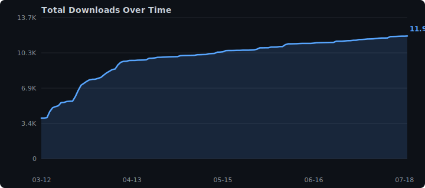

# GoudEngine

> **Alpha Release** — GoudEngine is under active development. APIs and SDKs change frequently. Use with caution in production. Questions? [aram.devdocs@gmail.com](mailto:aram.devdocs@gmail.com). Found a bug? [Open an issue](https://github.com/aram-devdocs/GoudEngine/issues).

[](https://github.com/aram-devdocs/GoudEngine/actions/workflows/ci.yml)
[](https://codecov.io/gh/aram-devdocs/GoudEngine)
[](https://github.com/aram-devdocs/GoudEngine/actions/workflows/security.yml)
[](https://opensource.org/licenses/MIT)
[](https://goudengine.aramhammoudeh.com/)

[](https://crates.io/crates/goud-engine)
[](https://www.npmjs.com/package/goudengine)
[](https://www.nuget.org/packages/GoudEngine/)
[](https://pypi.org/project/goudengine/)
[](https://central.sonatype.com/artifact/io.github.aram-devdocs/goudengine)
[](https://luarocks.org/modules/aram-devdocs/goudengine)
[](https://pkg.go.dev/github.com/aram-devdocs/GoudEngine/sdks/go/goud)

[](#downloads)

Game engine written in Rust. Build 2D and 3D games from Rust, C#, Python, TypeScript, C, C++, Go, Kotlin, Swift, or Lua.

## Get Started

Pick your language and follow the guide -- you'll have a window open in 5 minutes.

| Language | Install | Guide | Examples |
|----------|---------|-------|----------|
| Rust | `cargo add goud-engine` | [Getting Started](docs/src/getting-started/rust.md) | [Rust examples](examples/rust/) |
| C# (.NET) | `dotnet add package GoudEngine` | [Getting Started](docs/src/getting-started/csharp.md) | [C# examples](examples/csharp/) |
| Python | `pip install goudengine` | [Getting Started](docs/src/getting-started/python.md) | [Python examples](examples/python/) |
| TypeScript | `npm install goudengine` | [Getting Started](docs/src/getting-started/typescript.md) | [TypeScript examples](examples/typescript/) |
| C | Header-only | [Getting Started](docs/src/getting-started/c-cpp.md) | [C examples](examples/c/) |
| C++ | CMake / Meson | [Getting Started](docs/src/getting-started/c-cpp.md) | [C++ examples](examples/cpp/) |
| Go | `go get github.com/aram-devdocs/GoudEngine/sdks/go` | [Getting Started](docs/src/getting-started/go.md) | [Go examples](examples/go/) |
| Kotlin | `implementation("io.github.aram-devdocs:goudengine:0.0.839")` | [Getting Started](docs/src/getting-started/kotlin.md) | [Kotlin examples](examples/kotlin/) |
| Swift | Swift Package Manager | [Getting Started](docs/src/getting-started/swift.md) | [Swift examples](examples/swift/) |
| Lua | `luarocks install goudengine` | [Getting Started](docs/src/getting-started/lua.md) | [Lua examples](examples/lua/) |

### Package Naming

The canonical name is **GoudEngine**, adapted to each language's registry conventions:

| Convention | Registries | Package Name |
|------------|-----------|--------------|
| Lowercase | npm, PyPI, LuaRocks, Maven Central | `goudengine` |
| PascalCase | NuGet, Swift Package Manager | `GoudEngine` |
| Kebab-case | crates.io | `goud-engine` |

> **Migrating from an older version?** Python imports changed from `from goud_engine import ...` to `from goudengine import ...`. Kotlin's Maven artifact changed from `goud-engine-kotlin` to `goudengine`. See [CHANGELOG.md](CHANGELOG.md) for details.

## Design Philosophy

**All logic lives in Rust.** Language SDKs are thin wrappers that marshal data and call FFI functions, ensuring consistent behavior across all 10 bindings.

## Features

- Multi-language SDK support: Rust (native), C#, Python, TypeScript, C, C++, Go, Kotlin, Swift, Lua
- Rust-first architecture: all logic in Rust, SDKs are thin FFI wrappers
- WASM support: TypeScript SDK runs in browsers via WebAssembly
- Flexible renderer selection: 2D or 3D at runtime
- 2D rendering: sprites, 2D camera, Tiled map support
- 3D rendering: primitives (cubes, spheres, planes, cylinders)
- wgpu rendering backend (Vulkan/Metal/DX12/WebGPU) with OpenGL 3.3 legacy option
- winit windowing with GLFW legacy option
- Dynamic lighting: point, directional, and spot lights
- Physics simulation: Rapier 2D/3D rigid bodies, colliders, raycasting, collision events
- Audio playback: rodio-powered per-channel volume (Music, SFX, Ambience, UI, Voice) and spatial audio
- Text rendering: TrueType and bitmap fonts with alignment and word-wrapping
- Animation system: state machine controller, multi-layer blending, tweening
- Scene management: transitions (instant, fade, custom)
- UI component system: hierarchical node tree
- Networking: UDP, TCP, WebSocket, and WebRTC protocols
- Entity Component System (ECS): high-performance game object management
- Input handling: keyboard and mouse with frame-based state tracking
- Structured error diagnostics with error codes and recovery hints

## Examples

See [examples/README.md](examples/README.md) for the full list with run commands. All examples use `./dev.sh`:

```sh
./dev.sh --game flappy_goud                          # C# Flappy Bird
./dev.sh --game 3d_cube                              # C# 3D demo
./dev.sh --game feature_lab                          # C# headless feature lab
./dev.sh --sdk python --game flappy_bird             # Python Flappy Bird
./dev.sh --sdk typescript --game flappy_bird         # TypeScript desktop
./dev.sh --sdk typescript --game flappy_bird_web     # TypeScript web
./dev.sh --sdk go --game flappy_bird                 # Go Flappy Bird
./dev.sh --sdk kotlin --game flappy_bird             # Kotlin Flappy Bird
./dev.sh --sdk swift --game flappy_bird              # Swift Flappy Bird
./dev.sh --sdk lua --game flappy_bird                # Lua Flappy Bird
cargo run -p flappy-bird                             # Rust Flappy Bird
```

## Debugger Runtime

Desktop/native SDKs now expose the shared debugger runtime surface for snapshots, control, debug draw, capture, replay, metrics export, and MCP attach.

- Enable it through config before creating the game or headless context.
- Use the raw JSON accessors for the full snapshot, capture, replay, and metrics payloads.
- Use the thin helpers to pause, step, change time scale, inject input, and toggle debug draw.
- TypeScript browser/WASM builds do not support the debugger runtime in this batch.
- The runtime is local-only. `goudengine-mcp` attaches over local IPC instead of running inside the game process.

See [Debugger Runtime Guide](docs/src/guides/debugger-runtime.md) for scope, determinism limits, artifact formats, and the MCP workflow.

## Architecture

```
┌─────────────────────────────────────────────────────────────────────┐
│                          Your Game Code                             │
│   (Rust / C# / Python / TypeScript / C / C++ / Go / Kotlin /       │
│    Swift / Lua)                                                     │
└─────────────────────────────────────────────────────────────────────┘
                                │
                                ▼
┌─────────────────────────────────────────────────────────────────────┐
│                         Language SDKs                               │
│  ┌────────┐ ┌────────┐ ┌────────┐ ┌──────────────┐ ┌─────┐ ┌─────┐│
│  │  Rust  │ │  C#    │ │ Python │ │  TypeScript   │ │  C  │ │ C++ ││
│  │(native)│ │(csbin- │ │(ctypes)│ │(napi + WASM)  │ │(hdr)│ │(RAII││
│  │        │ │ dgen)  │ │        │ │               │ │     │ │)    ││
│  └────────┘ └────────┘ └────────┘ └──────────────┘ └─────┘ └─────┘│
│  ┌────────┐ ┌────────┐ ┌────────┐ ┌──────────────┐                │
│  │   Go   │ │ Kotlin │ │ Swift  │ │     Lua      │                │
│  │  (cgo) │ │ (JNI)  │ │(C FFI) │ │   (mlua)     │                │
│  └────────┘ └────────┘ └────────┘ └──────────────┘                │
└─────────────────────────────────────────────────────────────────────┘
                                │
                                ▼
┌─────────────────────────────────────────────────────────────────────┐
│                       Rust Engine Core                              │
│  ┌──────────┐ ┌──────────┐ ┌──────────┐ ┌──────────┐              │
│  │ Graphics │ │   ECS    │ │ Platform │ │  Audio   │              │
│  │(wgpu ·   │ │ (World)  │ │(winit ·  │ │ (rodio)  │              │
│  │ OpenGL)  │ │          │ │ GLFW)    │ │          │              │
│  └──────────┘ └──────────┘ └──────────┘ └──────────┘              │
│  ┌──────────┐ ┌──────────┐ ┌──────────┐ ┌──────────┐              │
│  │ Physics  │ │   Text   │ │Animation │ │Networking│              │
│  │(Rapier)  │ │Rendering │ │ System   │ │(UDP/TCP/ │              │
│  │          │ │          │ │          │ │ WS/WebRTC│              │
│  └──────────┘ └──────────┘ └──────────┘ └──────────┘              │
└─────────────────────────────────────────────────────────────────────┘
```

### Codegen Pipeline

SDK bindings are generated from a unified schema:

```
codegen/goud_sdk.schema.json   (source of truth)
         │
         ├── gen_csharp.py     → sdks/csharp/
         ├── gen_python.py     → sdks/python/
         ├── gen_ts_node.py    → sdks/typescript/ (Node.js/napi)
         ├── gen_ts_web.py     → sdks/typescript/wasm/ (WebAssembly)
         ├── gen_swift.py      → sdks/swift/
         ├── gen_kotlin.py     → sdks/kotlin/
         ├── gen_go.py         → sdks/go/internal/ffi/
         ├── gen_go_sdk.py     → sdks/go/goud/
         └── gen_lua.py        → sdks/lua/
```

See `codegen/AGENTS.md` for details.

### Project Directory

| Directory | Purpose |
|-----------|---------|
| `libs/` | Core libraries (graphics, platform, ECS, logger) |
| `goud_engine/` | Engine crate (core, assets, SDK, FFI) |
| `goud_engine_macros/` | Procedural macros |
| `sdks/` | Language SDKs (Rust, C#, Python, TypeScript, C, C++, Go, Kotlin, Swift, Lua) |
| `codegen/` | Unified SDK code generation pipeline |
| `tools/` | Development utilities (lint-layers) |
| `examples/` | Example games organized by SDK language |
| `docs/` | mdBook documentation site source |
| `scripts/` | Build, codegen, and CI helper scripts |
| `ports/` | Package manager ports (Conan, vcpkg) |

## Alpha Roadmap

GoudEngine is working toward an alpha release. The full plan covers physics, audio, text rendering, animation, scenes, UI, 10 SDK languages, mobile/console support, and a networking system.

- **[ALPHA_ROADMAP.md](ALPHA_ROADMAP.md)** — Full technical roadmap
- **[Master tracking issue](https://github.com/aram-devdocs/GoudEngine/issues/114)** — ALPHA-001: GoudEngine Alpha Release
- **[Contributing](CONTRIBUTING.md)** — How to contribute

## Documentation

- **[Documentation site](https://goudengine.aramhammoudeh.com/)** — Full guides, architecture, and API reference
- [SDK-First Architecture](docs/src/architecture/sdk-first.md)
- [Adding a New Language](docs/src/architecture/adding-a-language.md)
- [Development Guide](docs/src/development/guide.md) — dev.sh, Git hooks, version management
- [Building](docs/src/development/building.md) — build.sh, package.sh, NuGet feed
- [AI Setup](docs/src/development/ai-setup.md) — Claude Code, Cursor, Gemini configuration

## Community

<!-- COMMUNITY-STATS:START -->
| | Stars | Forks | Contributors |
|--|-------|-------|--------------|
| **GitHub** |  |  |  |

### Downloads

| Registry | Total Downloads |
|----------|-----------------|
| crates.io | [43](https://crates.io/crates/goud-engine) |
| NuGet | [2,292](https://www.nuget.org/packages/GoudEngine/) |
| PyPI | [4,738](https://pypi.org/project/goudengine/) |
| npm | [2,052](https://www.npmjs.com/package/goudengine) |
| Maven Central | [0](https://central.sonatype.com/artifact/io.github.aram-devdocs/goudengine) |
| LuaRocks | [0](https://luarocks.org/modules/aram-devdocs/goudengine) |
| Go | [0 versions](https://pkg.go.dev/github.com/aram-devdocs/GoudEngine/sdks/go/goud) |

<sub>PyPI totals exclude mirrors.</sub>



[](https://star-history.com/#aram-devdocs/GoudEngine&Date)

<sub>Last updated: 2026-04-08 via [GitHub Action](.github/workflows/community-stats.yml)</sub>
<!-- COMMUNITY-STATS:END -->

## License

MIT
