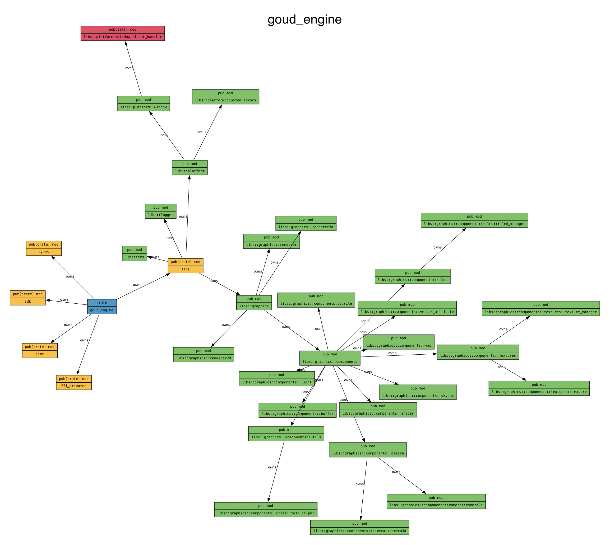

# GoudEngine

[](https://github.com/aram-devdocs/GoudEngine/actions/workflows/ci.yml)
[](https://codecov.io/gh/aram-devdocs/GoudEngine)
[](https://github.com/aram-devdocs/GoudEngine/actions/workflows/security.yml)
[](https://opensource.org/licenses/MIT)
[](https://www.rust-lang.org/)
[](https://dotnet.microsoft.com/)
[](https://www.python.org/)
[](https://www.nuget.org/packages/GoudEngine/)

GoudEngine is a game engine written in Rust with multi-language SDK support. It provides a set of tools and libraries for creating 2D and 3D games, accessible from Rust, C#, and Python.

## Design Philosophy

**All logic lives in Rust.** The engine follows a Rust-first architecture where all game logic, components, and systems are implemented in Rust. Language SDKs (C#, Python) are thin wrappers that marshal data and call FFI functions, ensuring consistent behavior across all bindings.

## Features

- **Multi-language SDK support**: Rust (native), C# (.NET), and Python
- **Rust-first architecture**: All logic in Rust, SDKs are thin FFI wrappers
- **Flexible renderer selection**: 2D or 3D at runtime
- **2D rendering**: Sprites, 2D camera, Tiled map support
- **3D rendering**: Primitives (cubes, spheres, planes, cylinders)
- **Dynamic lighting**: Point, directional, and spot lights
- **Entity Component System (ECS)**: High-performance game object management
- **Input handling**: Keyboard, mouse with frame-based state tracking
- **Window management**: Cross-platform via GLFW
- **Graphics rendering**: OpenGL backend

## Architecture

GoudEngine follows a layered architecture with all game logic in Rust:

```
┌─────────────────────────────────────────────────────────────┐
│                    Your Game Code                            │
│            (Rust / C# / Python)                              │
└─────────────────────────────────────────────────────────────┘
                              │
                              ▼
┌─────────────────────────────────────────────────────────────┐
│                     Language SDKs                            │
│  ┌─────────────┐  ┌─────────────┐  ┌─────────────┐         │
│  │  Rust SDK   │  │   C# SDK    │  │ Python SDK  │         │
│  │ (zero FFI)  │  │ (csbindgen) │  │  (ctypes)   │         │
│  └─────────────┘  └─────────────┘  └─────────────┘         │
└─────────────────────────────────────────────────────────────┘
                              │
                              ▼
┌─────────────────────────────────────────────────────────────┐
│                    Rust Engine Core                          │
│  ┌─────────┐ ┌─────────┐ ┌─────────┐ ┌─────────┐          │
│  │Graphics │ │   ECS   │ │Platform │ │  Audio  │          │
│  │(OpenGL) │ │ (World) │ │ (GLFW)  │ │         │          │
│  └─────────┘ └─────────┘ └─────────┘ └─────────┘          │
└─────────────────────────────────────────────────────────────┘
```

### Module Dependency Graph

Below is the module dependency graph showing the relationship between different components:



You can regenerate this module dependency graph by running:

```sh
./graph.sh
```

This will create both PNG and PDF versions of the module graph using `cargo modules` and GraphViz tools.

## Development

### Quick Start
For rapid development and testing, use the `dev.sh` script:

```sh
# C# SDK (default)
./dev.sh --game flappy_goud  # 2D game example
./dev.sh --game 3d_cube      # 3D game example
./dev.sh --game goud_jumper  # Platform game example
./dev.sh --game flappy_goud --local  # Use local NuGet

# Python SDK
./dev.sh --sdk python --game python_demo  # Run Python demo
./dev.sh --sdk python --game flappy_bird  # Run Python Flappy Bird

# Rust SDK
./dev.sh --sdk rust  # Run Rust SDK tests
```

### Git Hooks with husky-rs
This project uses husky-rs for managing Git hooks. We have pre-commit hooks set up to ensure code quality before commits.

**Important:** After modifying the pre-commit script in `.husky/hooks/pre-commit`, you must run:
```sh
cargo clean && cargo test
```
This is required for the changes to take effect due to how husky-rs works with `build.rs`.

### Version Management
**Important:** After making changes to the engine, you MUST increment the version numbers for your changes to propagate through the SDK and NuGet packages. Use the version increment script:

```sh
./increment_version.sh         # Increments patch version (0.0.X)
./increment_version.sh --minor # Increments minor version (0.X.0)
./increment_version.sh --major # Increments major version (X.0.0)
```

This script automatically updates versions in:
- `goud_engine/Cargo.toml` (source of truth)
- `sdks/GoudEngine/GoudEngine.csproj`
- All `.csproj` files in the `/examples` directory

Without incrementing the version, your changes will not be reflected in dependent projects using the NuGet package.

## Building the Project

To build the project in release mode, run the following script:

```sh
./build.sh
```

This script will build the Rust project and copy the generated dynamic library to the `GoudEngine` directory. It will also add the DLL files into `GoudEngine` and create a NuGet package in the `nuget_package_output` directory.

## Packaging and Submitting to NuGet

To build and submit the package to the local NuGet repository, run the following script:

```sh
./package.sh
```

This script will build the package and submit it to the local NuGet repository. From there, you can use the following command to add the package to your project:

```sh
dotnet add package GoudEngine --version <desired_version>
```

## Sample Games

### C# Examples

#### 2D Sample: Flappy Goud
```sh
cd examples/flappy_goud
dotnet build
dotnet run
```

#### 3D Sample: Cube Demo
```sh
cd examples/3d_cube
dotnet build
dotnet run
```

### Python Examples

#### SDK Demo
Demonstrates Transform2D, Sprite components, and entity management:
```sh
cd examples/python_demo
python main.py
```

#### Flappy Bird (Python)
A complete Flappy Bird clone demonstrating the Python SDK:
```sh
cd examples/python_demo
python flappy_bird.py
```

**Controls:**
- `SPACE` or `Left Click` - Flap / Jump
- `R` - Restart
- `ESC` - Quit

## Usage

### Rust SDK (Native)

The Rust SDK provides zero-overhead access to the engine with full type safety:

```rust
use goud_engine::sdk::{GoudGame, GameConfig};
use goud_engine::sdk::components::{Transform2D, Sprite};
use goud_engine::core::math::Vec2;

fn main() {
    // Create game with fluent config
    let mut game = GoudGame::new(GameConfig::new("My Game", 800, 600))
        .expect("Failed to create game");

    // Spawn entities using builder pattern
    let player = game.spawn()
        .with(Transform2D::from_position(Vec2::new(100.0, 100.0)))
        .with(Sprite::default())
        .build();

    // Run game loop
    game.run(|ctx, world| {
        // Update logic using delta time
        if let Some(transform) = world.get_mut::<Transform2D>(player) {
            transform.position.x += 100.0 * ctx.delta_time();
        }
        
        // Quit after 5 seconds
        if ctx.total_time() > 5.0 {
            ctx.quit();
        }
    });
}
```

### C# SDK

The C# SDK provides a .NET interface via FFI bindings:

```csharp
using System;
using GoudEngine;

class Program
{
    static void Main(string[] args)
    {
        // Initialize with 2D renderer (default)
        GoudGame game = new GoudGame(800, 600, "2D Game");

        game.Initialize(() =>
        {
            Console.WriteLine("Game Initialized!");
            Sprite backgroundData = new Sprite { X = 0, Y = 0, ScaleX = 1, ScaleY = 1, Rotation = 0 };
            game.AddSprite("assets/sprites/background.png", backgroundData);
        });

        game.Start(() => Console.WriteLine("Game Started!"));
        game.Update(() => { /* Update logic */ });
        game.Terminate();
    }
}
```

Example with 3D renderer:

```csharp
// Initialize with 3D renderer
GoudGame game = new GoudGame(800, 600, "3D Game", RendererType.Renderer3D);

game.Initialize(() =>
{
    // Create a textured cube
    uint textureId = game.CreateTexture("assets/textures/cube.png");
    uint cubeId = game.CreateCube(textureId);
    
    // Add dynamic lighting
    game.AddPointLight(
        positionX: 0, positionY: 2, positionZ: 3,
        colorR: 1.0f, colorG: 0.5f, colorB: 0.5f
    );
});
```

### Python SDK

The Python SDK uses ctypes for FFI bindings (no external dependencies):

```python
from goud_engine import GoudGame, Transform2D, Sprite, Keys

# Create game window
game = GoudGame(800, 600, "My Python Game")

# Load textures
player_tex = game.load_texture("assets/player.png")

# Create components (all logic delegates to Rust)
transform = Transform2D.from_position(100, 100)
sprite = Sprite(texture_handle=player_tex).with_color(1.0, 0.5, 0.5, 1.0)

# Game loop
while game.is_running():
    dt = game.begin_frame()
    
    # Input handling
    if game.key_just_pressed(Keys.ESCAPE):
        game.close()
    
    # Movement
    if game.key_pressed(Keys.RIGHT):
        transform.translate(200 * dt, 0)
    
    game.end_frame()

game.destroy()
```

## Documentation

### SDK Documentation
- **Rust SDK**: See [`goud_engine/src/sdk/mod.rs`](goud_engine/src/sdk/mod.rs) for API documentation
- **C# SDK**: See [`sdks/GoudEngine/`](sdks/GoudEngine/) for .NET integration
- **Python SDK**: See [`sdks/python/README.md`](sdks/python/README.md) for Python bindings

### External References
- [csbindgen](https://github.com/Cysharp/csbindgen) - C# bindings generator
- [cbindgen](https://github.com/mozilla/cbindgen) - C header generator

## License

This project is licensed under the MIT License - see the LICENSE file for details.
