<!-- AUTO-GENERATED by scripts/generate-showcase-docs.py. DO NOT EDIT. -->
# Example Showcase

This page and preview media are generated from `examples/showcase.manifest.json` and `scripts/generate-showcase-docs.py`.
Run `python3 scripts/generate-showcase-docs.py` after metadata or media changes.

Current release status:
- Source links, run commands, and preview media are generated for entries in `examples/`.

## Baseline parity game: Flappy Bird

Flappy Bird is the behavior baseline across SDKs.

| Example | SDK | Target | Path | Run command | Description | Media | Source |
|---|---|---|---|---|---|---|---|
| Flappy Goud | C# | Desktop | `examples/csharp/flappy_goud` | `./dev.sh --game flappy_goud` | Flappy Bird parity baseline. | 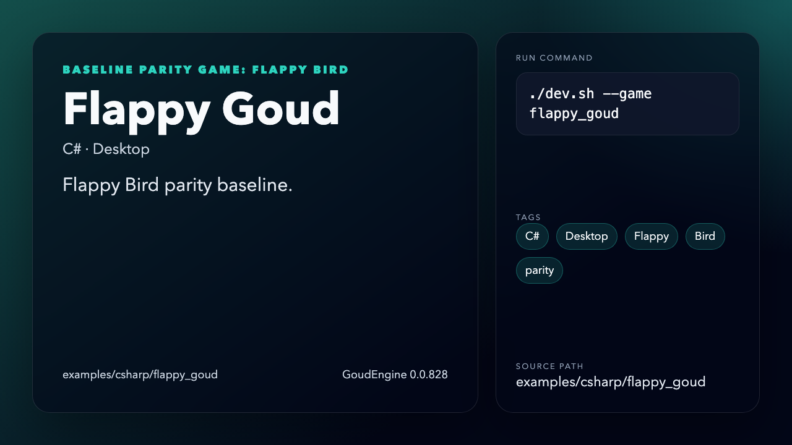 | [GitHub](https://github.com/aram-devdocs/GoudEngine/tree/main/examples/csharp/flappy_goud) |
| Flappy Bird | Python | Desktop | `examples/python/flappy_bird.py` | `./dev.sh --sdk python --game flappy_bird` | Python parity baseline. | 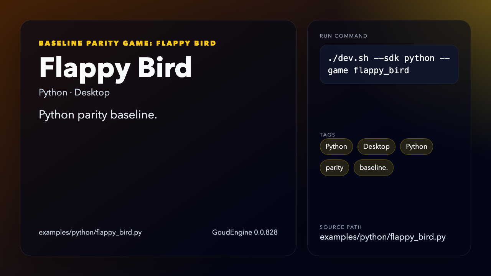 | [GitHub](https://github.com/aram-devdocs/GoudEngine/blob/main/examples/python/flappy_bird.py) |
| Flappy Bird | TypeScript | Desktop | `examples/typescript/flappy_bird/desktop.ts` | `./dev.sh --sdk typescript --game flappy_bird` | TypeScript desktop parity baseline. | 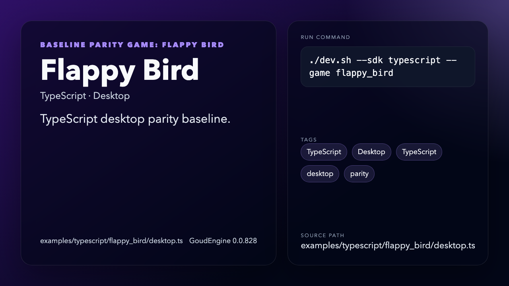 | [GitHub](https://github.com/aram-devdocs/GoudEngine/blob/main/examples/typescript/flappy_bird/desktop.ts) |
| Flappy Bird | TypeScript | Web | `examples/typescript/flappy_bird/web` | `./dev.sh --sdk typescript --game flappy_bird_web` | TypeScript web parity baseline. | 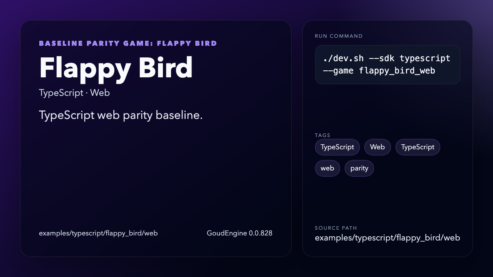 | [GitHub](https://github.com/aram-devdocs/GoudEngine/tree/main/examples/typescript/flappy_bird/web) |
| Flappy Bird | Rust | Desktop | `examples/rust/flappy_bird` | `cargo run -p flappy-bird` | Native Rust parity baseline. | 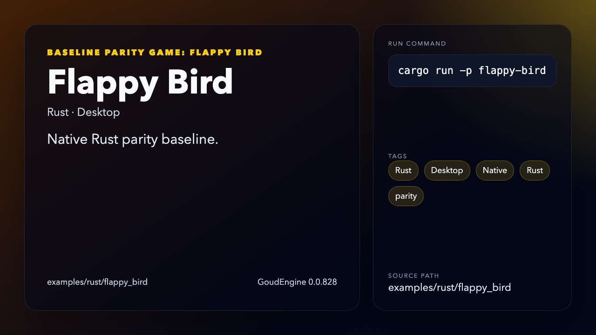 | [GitHub](https://github.com/aram-devdocs/GoudEngine/tree/main/examples/rust/flappy_bird) |

## Feature Lab parity smoke

Feature Lab validates broader API surface than Flappy Bird.

| Example | SDK | Target | Path | Run command | Description | Media | Source |
|---|---|---|---|---|---|---|---|
| Feature Lab | C# | Headless | `examples/csharp/feature_lab` | `./dev.sh --game feature_lab` | Headless smoke for ECS and provider wrappers. | 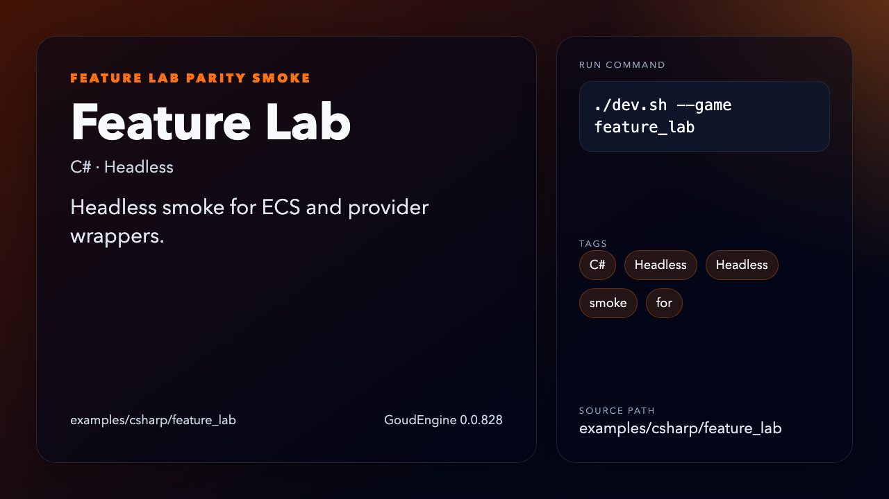 | [GitHub](https://github.com/aram-devdocs/GoudEngine/tree/main/examples/csharp/feature_lab) |
| Feature Lab | Python | Headless | `examples/python/feature_lab.py` | `python3 examples/python/feature_lab.py` | Headless smoke for generated wrappers. | 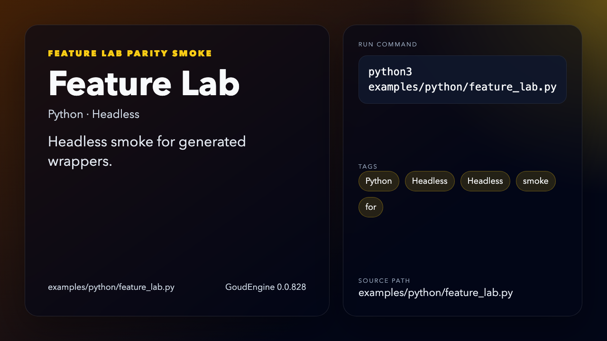 | [GitHub](https://github.com/aram-devdocs/GoudEngine/blob/main/examples/python/feature_lab.py) |
| Feature Lab | TypeScript | Desktop | `examples/typescript/feature_lab/desktop.ts` | `./dev.sh --sdk typescript --game feature_lab` | Desktop smoke for SDK capability probes. | 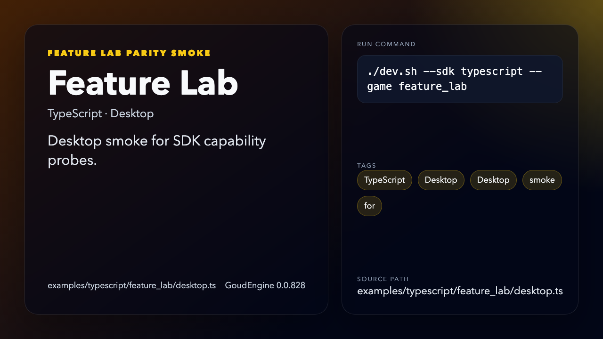 | [GitHub](https://github.com/aram-devdocs/GoudEngine/blob/main/examples/typescript/feature_lab/desktop.ts) |
| Feature Lab | TypeScript | Web | `examples/typescript/feature_lab/web` | `./dev.sh --sdk typescript --game feature_lab_web` | Web smoke with browser/WASM coverage. | 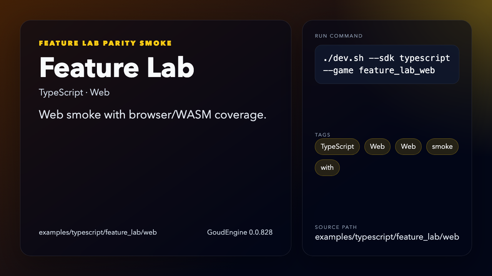 | [GitHub](https://github.com/aram-devdocs/GoudEngine/tree/main/examples/typescript/feature_lab/web) |
| Feature Lab | Rust | Headless | `examples/rust/feature_lab` | `cargo run -p feature-lab` | Native Rust smoke for SDK coverage. | 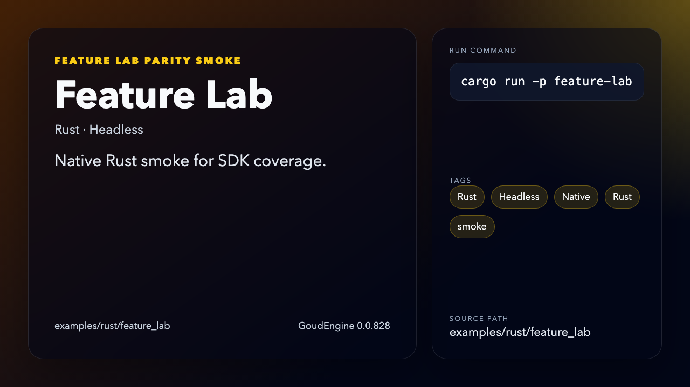 | [GitHub](https://github.com/aram-devdocs/GoudEngine/tree/main/examples/rust/feature_lab) |

## C# specialization demos

C#-specific gameplay and renderer examples.

| Example | SDK | Target | Path | Run command | Description | Media | Source |
|---|---|---|---|---|---|---|---|
| 3D Cube | C# | Desktop | `examples/csharp/3d_cube` | `./dev.sh --game 3d_cube` | 3D renderer demo. | 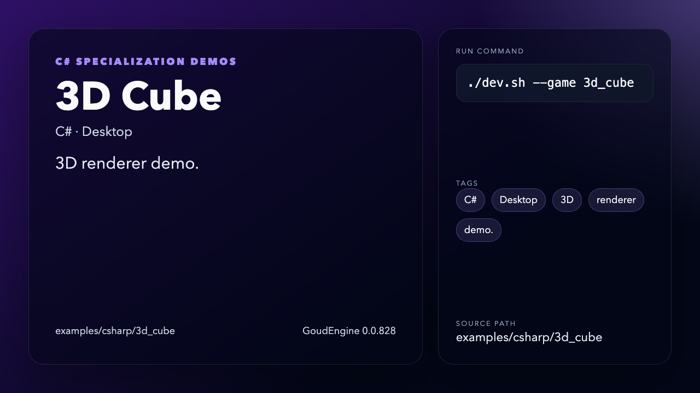 | [GitHub](https://github.com/aram-devdocs/GoudEngine/tree/main/examples/csharp/3d_cube) |
| Goud Jumper | C# | Desktop | `examples/csharp/goud_jumper` | `./dev.sh --game goud_jumper` | Platform movement and collision. | 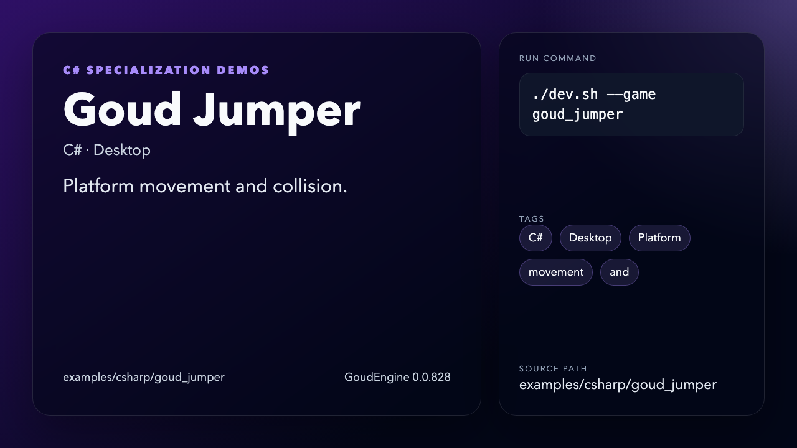 | [GitHub](https://github.com/aram-devdocs/GoudEngine/tree/main/examples/csharp/goud_jumper) |
| Isometric RPG | C# | Desktop | `examples/csharp/isometric_rpg` | `./dev.sh --game isometric_rpg` | Isometric camera and RPG systems. | 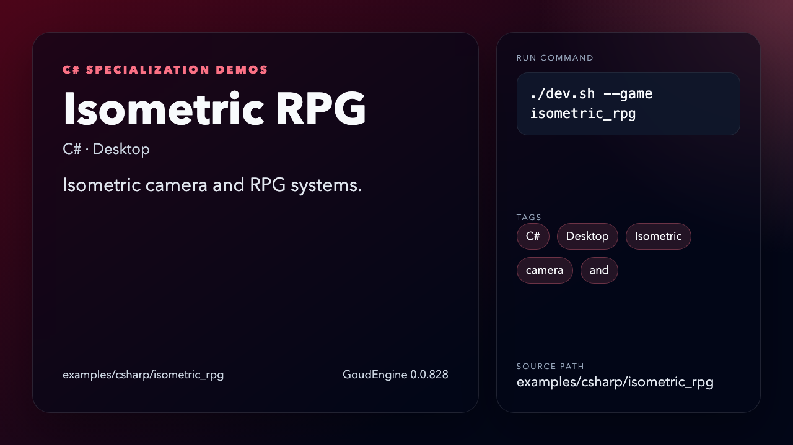 | [GitHub](https://github.com/aram-devdocs/GoudEngine/tree/main/examples/csharp/isometric_rpg) |
| Hello ECS | C# | Desktop | `examples/csharp/hello_ecs` | `./dev.sh --game hello_ecs` | Minimal ECS starter. | 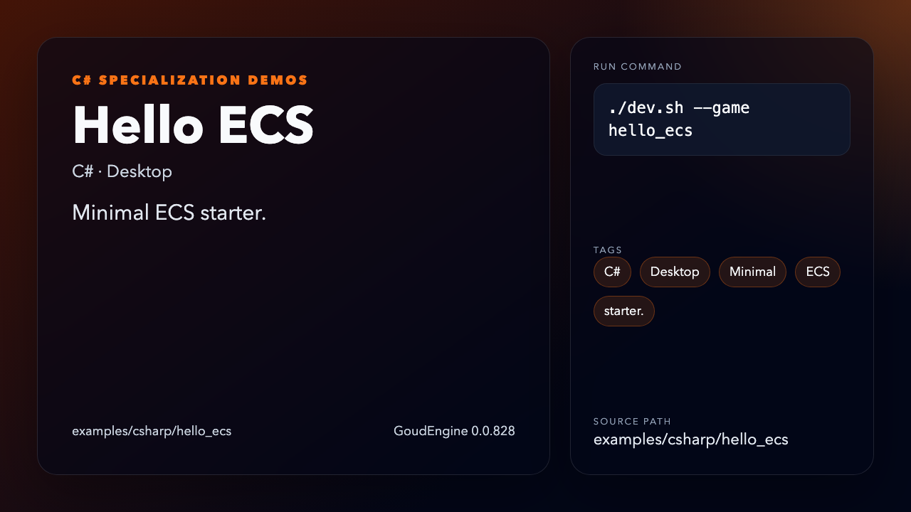 | [GitHub](https://github.com/aram-devdocs/GoudEngine/tree/main/examples/csharp/hello_ecs) |

## Starter demos

Single-file SDK demos used for quick setup checks.

| Example | SDK | Target | Path | Run command | Description | Media | Source |
|---|---|---|---|---|---|---|---|
| Python SDK Demo | Python | Desktop | `examples/python/main.py` | `./dev.sh --sdk python --game python_demo` | Minimal Python startup demo. | 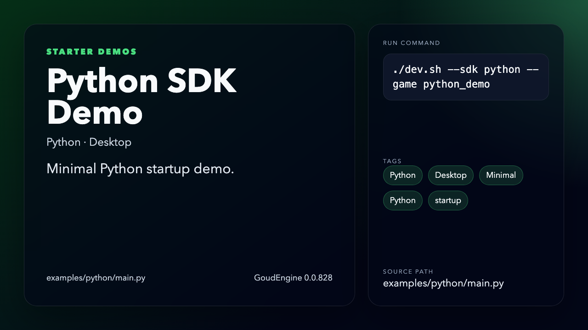 | [GitHub](https://github.com/aram-devdocs/GoudEngine/blob/main/examples/python/main.py) |

## Notes

- This page is generated. Update `examples/showcase.manifest.json` and rerun the generator.
- Generator validation fails if examples are added or removed without manifest updates.
